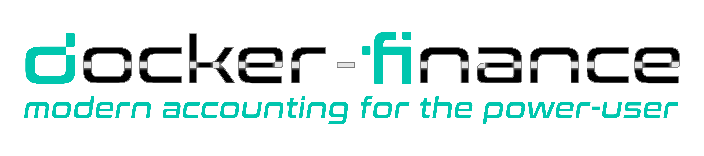
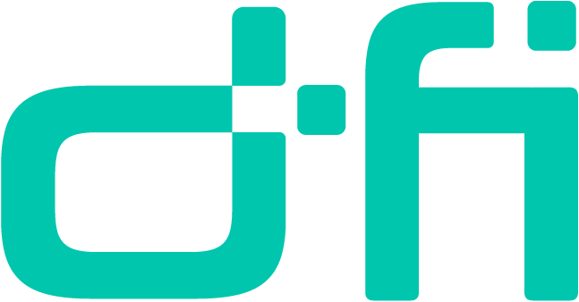


[//]: # (docker-finance | modern accounting for the power-user)
[//]: # ()
[//]: # (Copyright [C] 2021-2025 Aaron Fiore [Founder, Evergreen Crypto LLC])
[//]: # ()
[//]: # (This program is free software: you can redistribute it and/or modify)
[//]: # (it under the terms of the GNU General Public License as published by)
[//]: # (the Free Software Foundation, either version 3 of the License, or)
[//]: # ([at your option] any later version.)
[//]: # ()
[//]: # (This program is distributed in the hope that it will be useful,)
[//]: # (but WITHOUT ANY WARRANTY; without even the implied warranty of)
[//]: # (MERCHANTABILITY or FITNESS FOR A PARTICULAR PURPOSE. See the)
[//]: # (GNU General Public License for more details.)
[//]: # ()
[//]: # (You should have received a copy of the GNU General Public License)
[//]: # (along with this program. If not, see <https://www.gnu.org/licenses/>.)

 (docker-finance) is a [quasi-"financial operating system"](https://gitea.evergreencrypto.co/EvergreenCrypto/dfi-docs/src/branch/master/markdown/What-does-it-do.md) of accounting for [variant ledgers and metadata](https://gitea.evergreencrypto.co/EvergreenCrypto/dfi-docs/src/branch/master/markdown/What-is-supported.md).

After [installing and configuring](https://gitea.evergreencrypto.co/EvergreenCrypto/dfi-docs/src/branch/master/markdown/How-do-I-get-started.md), you can [learn how to use `dfi`](https://gitea.evergreencrypto.co/EvergreenCrypto/dfi-docs/src/branch/master/markdown/How-do-I-use-it.md). You can also [contribute](https://gitea.evergreencrypto.co/EvergreenCrypto/dfi-docs/src/branch/master/markdown/How-do-I-contribute.md) or [reach out](https://gitea.evergreencrypto.co/EvergreenCrypto/dfi-docs/src/branch/master/markdown/How-do-I-connect.md) at any time.

Please, consider the [legalese](https://gitea.evergreencrypto.co/EvergreenCrypto/dfi-docs/src/branch/master/markdown/Where-is-the-legalese.md) before using (or copying) this repository. All other documentation can be found [here](https://gitea.evergreencrypto.co/EvergreenCrypto/dfi-docs).

 

")
")

[//]: # (vim: sw=2 sts=2 si ai et)
